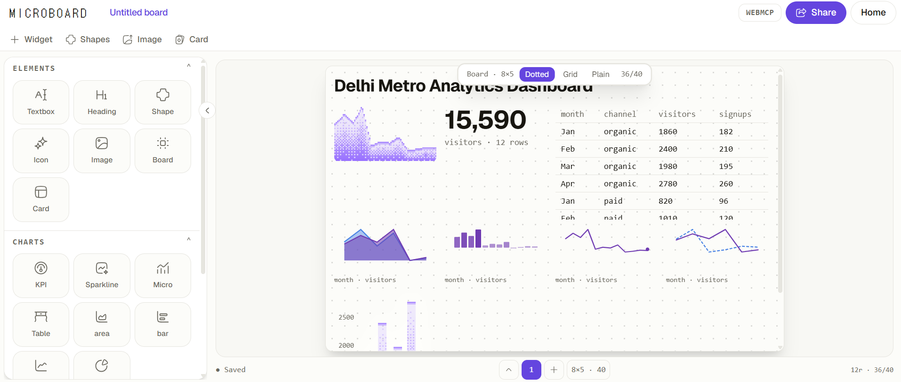

<!--
  Save your screenshot as "platform.jpg" in the ROOT of the repo (same folder as this
  README.md) so the hero image below renders on GitHub. Recommended size: 1600×900+.
-->

<div align="center">

# 🧩 Microboard

### Make modern data stories using AI — one board, one document, one approval away from wrong.

[](https://microboard-three.vercel.app)
[](https://convex.dev)
[](https://www.convex.dev/hackathons/all-gas)
[](LICENSE)

</div>

<hr>

<p align="center">
  
</p>

<hr>

## Table of Contents

- [Overview](#overview)
- [Why Microboard Exists](#why-microboard-exists)
- [Features](#features)
- [How It Works — Propose → Approve → Apply](#how-it-works--propose--approve--apply)
- [WebMCP Tools](#webmcp-tools)
- [The Board Document](#the-board-document)
- [Architecture](#architecture)
- [Use Cases](#use-cases)
- [Tech Stack](#tech-stack)
- [Routes](#routes)
- [Getting Started](#getting-started)
  - [1. Clone](#1-clone)
  - [2. Install](#2-install)
  - [3. Run Locally](#3-run-locally)
- [Deploying / Hosting](#deploying--hosting)
  - [Option A — Convex Sites (recommended)](#option-a--convex-sites-recommended)
  - [Option B — Vercel / any static host](#option-b--vercel--any-static-host)
- [Built for the Convex "All Gas" Hackathon](#built-for-the-convex-all-gas-hackathon)
- [Shoutouts & Credits](#shoutouts--credits)
- [License](#license)

---

## Overview

**Microboard** is a collaborative, AI-native data-to-dashboard workspace. You bring the data, an agent proposes what to do with it, you approve or reject, and both of you build a chart dashboard on the same live canvas. Neither side works from a copy — there is exactly one board, and the agent's only way to touch it is through the same door you use.

It's built around a single constraint: **the agent and the human read and write the same versioned document, and nothing consequential happens without a human clicking approve.** The result isn't just "AI makes charts" — it's that the provenance of every chart (which raw rows, which transform steps, in which order) is inspectable, replayable, and never silently mutated.

## Why Microboard Exists

Most "AI dashboard" demos are one of two things: a chatbot that describes a chart in prose, or an agent that silently rewrites your workspace and hopes you like the result when you tab back in. Both break the thing that makes a dashboard trustworthy — you no longer know exactly why a number looks the way it does, or who changed it.

The actual workflow analysts and PMs live in — spreadsheets, a scratch script, a chart tool, a screenshot into a deck — has no shared state at all. Every handoff is a re-explanation. Microboard fixes that by giving the human and the agent one shared, replayable document instead of two disconnected views of "the data."

## Features

- 🤝 **Human-in-the-loop agent loop** — every agent action is a *proposal*; nothing lands on the board without an explicit human approval.
- 🧾 **Deterministic, replayable audit trail** — a Power BI–style applied-steps log (`filter`, `groupBy`, `sum`, `sort`, `rename`, …) means the cleaned data can always be reproduced from the raw data.
- 📥 **Flexible data import** — load data via CSV, JSON, Excel, or paste-to-board.
- 📊 **Dithered & monochrome micro-charts** — a distinctive halftone/print aesthetic powered by [Dither Kit](https://www.tripwire.sh/dither-kit) and [Microcharts](https://microcharts.dev), for a look that reads like a printed report, not a generic SaaS dashboard.
- 🗂️ **Full data grid** — inspect and sort cleaned data in an AG Grid-powered table alongside your charts.
- 🖱️ **Live grid canvas** — drag, resize, and **lock** widgets the agent is not allowed to touch.
- 🔗 **Shareable, read-only boards** — publish a board to a public link (`/b/:id`) backed by Convex.
- 🖼️ **Export anywhere** — export the finished board as an image or a PDF.
- 🖼️ **Showcase gallery** — browse boards the community has shared.
- 🔐 **Convex Auth** — authenticated boards and ownership, out of the box.
- 📬 **Agent-powered email, via AgentMail** — a persistent, reactive inbox lets agents send and receive board-related email without polling.

## How It Works — Propose → Approve → Apply

This is the core design decision, not a UI nicety:

```
Agent calls get_board_state
        ↓
Agent calls propose_step / propose_widget
        ↓
Proposal renders in the Agent Activity panel
        ↓
Human approves
        ↓
apply_step / add_widget mutates the board
        ↓
version++, UI updates
```

No tool can finalize, publish, or overwrite a locked widget on its own. Every write returns a receipt. Every proposal checks the board version it was made against — if the human changed something in between, the proposal fails closed instead of clobbering the newer state.

## WebMCP Tools

| Tool | Kind | What it does |
|---|---|---|
| `get_board_state` | Read | Full board JSON + current version |
| `inspect_data` | Read | Column types, null counts, sample rows, basic stats |
| `propose_step` | Propose | Suggests a transform without applying it |
| `apply_step` | Write | Applies an approved step (requires human confirmation) |
| `propose_widget` | Propose | Suggests a chart |
| `add_widget` | Write | Adds an approved widget to the canvas |
| `update_layout` | Write | Moves / resizes widgets |
| `lock_widget` | Write | Human-only: freezes a widget against agent edits |
| `export_board` | Action | PNG / PDF / share link |

Schemas are narrow and closed on purpose — an agent that can call `propose_step` with an open-ended `params` object is an agent you can't reason about. Every tool does exactly one thing.

## The Board Document

```typescript
interface Board {
  id: string;
  title: string;
  version: number;          // bumped on every mutation
  data: {
    source: "inline" | "url" | "convex";
    raw: any[] | null;
    cleaned: any[] | null;
    columns: ColumnMeta[];
  };
  steps: Step[];             // ordered transform history — the audit trail
  layout: LayoutItem[];      // grid positions
  widgets: Record<string, Widget>;
  locks: string[];           // widget IDs the agent may not touch
}
```

`steps` is the load-bearing part of this schema. Replay it on `raw` and you always get `cleaned`. A shared board isn't a snapshot of pixels — it's a recipe. Anyone who opens `/b/:id` gets the same document and can see exactly how the data got to where it is.

## Architecture

Almost everything runs in the browser. There's no separate backend to keep in sync because there's nothing to sync — the board lives in a single Zustand store, and the agent's tools are just functions registered against that store. Convex only comes into play for two moments: saving a board when you click **Share**, and loading a public board or the showcase gallery.

```
Landing → Create (editor) → Live Canvas + Agent Panel
                                    ↓
                          Zustand Board Store (JSON)
                                    ↓
                     Agent Tools (document.modelContext)
                                    │
                            only on Share
                                    ↓
                          Convex (boards + links)
```

## Use Cases

- **Analysts** turning a messy CSV export into a trustworthy, presentable dashboard with an AI copilot doing the grunt work of cleaning and charting.
- **PMs / founders** spinning up a metrics board live during a stand-up or a customer call, with the agent proposing the cuts of the data as the conversation happens.
- **Support / ops teams** who need an auditable answer to "why does this number look like this?" — the step log *is* the answer.
- **Teams evaluating agentic UX patterns** — Microboard is a working reference implementation of a propose → approve → apply loop for giving an AI agent write access to a live document safely.
- **Educators / teams sharing a report** — publish a read-only board link instead of a static screenshot, so the underlying recipe stays inspectable.

## Tech Stack

| Layer | Choice |
|---|---|
| Framework | React 19 + TypeScript + Vite |
| Routing | React Router v7 |
| Styling | Tailwind CSS v4 + shadcn/ui + Base UI |
| Fonts / Icons | Geist Variable, DotGothic16, Hugeicons |
| State | Zustand |
| Backend | Convex (queries, mutations, actions, Convex Auth) |
| Agent email | AgentMail (`@agentmail/convex`) |
| Charts | Dither Kit · Microcharts (`@microcharts/react`) |
| Data grid | AG Grid |
| Data transforms | Plain TypeScript + Arquero, d3-scale, d3-shape |
| Import | `read-excel-file` (CSV / JSON / Excel) |
| Export | `html-to-image`, `jsPDF` |
| Motion | Motion |
| Package manager / runtime | Bun |
| Lint | Oxlint |
| Deploy | Convex Sites / Vercel |

## Routes

```
/          Landing
/create    Board editor — where the agent loop happens
/b/:id     Public, read-only shared board
/showcase  Gallery of shared boards
```

---

## Getting Started

### Prerequisites

- [Bun](https://bun.sh) (the repo uses Bun for scripts and package management)
- A free [Convex](https://convex.dev) account — only required if you want **Share** or **Showcase** to work end to end. The editor itself runs fully client-side without it.

### 1. Clone

```bash
git clone https://github.com/anjulbhatia/microboard.git
cd microboard
```

Or download the source directly from the [Code → Download ZIP](https://github.com/anjulbhatia/microboard/archive/refs/heads/main.zip) button on GitHub.

### 2. Install

```bash
bun install
```

### 3. Run Locally

**Option A — one command (script provided):**

```bash
bun run local
```

This runs `scripts/local.ts`, which starts `npx convex dev` (sync + watch) and Vite together in one process, waits for a live health check against your Convex deployment before continuing, and logs progress to `scripts/local.log`. Stop both with `Ctrl+C`. It reads your deployment from `.env.local` (`CONVEX_DEPLOYMENT`) — run `npx convex dev` once first if you haven't linked a deployment yet.

**Option B — plain Vite (no Convex required):**

```bash
bun dev
```

The board editor at `/create` runs entirely client-side; Convex is only needed for **Share** and **/showcase**.

Then open the printed local URL (Vite defaults to `http://localhost:5173`).

Other useful scripts:

```bash
bun run build     # tsc -b && vite build
bun run preview   # preview the production build
bun run lint       # oxlint
bun test           # bun test tests/
```

---

## Deploying / Hosting

### Option A — Convex Sites (recommended)

This is the path required for the Convex "All Gas" hackathon: your live app needs to resolve at a `*.convex.site` URL.

```bash
bun add @convex-dev/static-hosting
npx @convex-dev/static-hosting setup
```

`setup` wires the component into `convex/convex.config.ts` and adds a `deploy` script to `package.json`. Then, to ship:

```bash
npx convex login   # first time only
bun run deploy
```

This builds the frontend, deploys your Convex backend, and uploads `dist/` in one step. Your app is live at:

```
https://<your-deployment>.convex.site
```

### Option B — Vercel / any static host

Microboard is a standard Vite SPA and deploys anywhere static hosting is available:

```bash
bun run build
```

Then deploy the resulting `dist/` folder to Vercel, Netlify, GitHub Pages, or your host of choice. Set `VITE_CONVEX_URL` (from your Convex deployment) as an environment variable if you want Share/Showcase to work in production. The current live demo (see badge above) is hosted this way.

---

## Built for the Convex "All Gas" Hackathon

Microboard was built for the **[Convex "All Gas" Global Hackathon](https://www.convex.dev/hackathons/all-gas)**, sponsored by **Convex**, **OpenAI**, **Firecrawl**, and **AgentMail**.

- **Convex depth** — boards, share links, auth, and the showcase gallery are backed by real Convex queries, mutations, and live-updating reads, not a thin frontend bolted onto a hosted page.
- **AgentMail** — the agent's email capabilities are powered end-to-end by the `@agentmail/convex` component, giving Microboard a stateful, reactive inbox with no polling.
- **Live URL** — see the badges at the top of this README, and the [Deploying / Hosting](#deploying--hosting) section for standing up your own `convex.site` instance.

## Shoutouts & Credits

Microboard leans heavily on a handful of great projects — thank you to their teams:

- **[Convex](https://convex.dev)** — the reactive backend that makes "share a board and see it update live" almost trivial. Boards, links, and the showcase gallery all live here.
- **[AgentMail](https://agentmail.to)** — a stateful, reactive email inbox purpose-built for AI agents, wired in via `@agentmail/convex`. It's what lets an agent send and receive board-related email without ever polling.
- **[Microcharts](https://microcharts.dev)** (`@microcharts/react`) — word-sized, accessible React charts with generated alt text, used throughout Microboard's compact chart widgets.
- **[TanStack](https://tanstack.com)** — for the headless, composable approach to charts and tables that shaped how Microboard's own widget and data-grid primitives are put together.
- **[Dither Kit](https://www.tripwire.sh/dither-kit)** by [tripwire.sh](https://tripwire.sh) — composable, dithered charts (area, bar, pie, radar) for shadcn/ui, on one tiny canvas engine. It's the source of Microboard's signature halftone, print-like chart look.

## License

Microboard is [MIT licensed](LICENSE).

© 2026 [Anjul Bhatia](https://github.com/anjulbhatia)